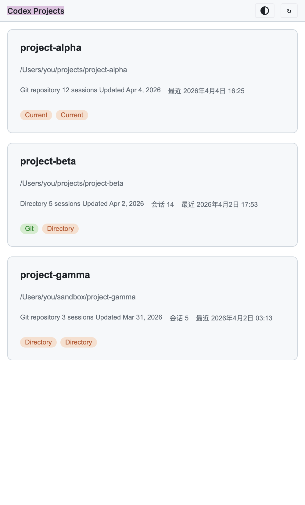
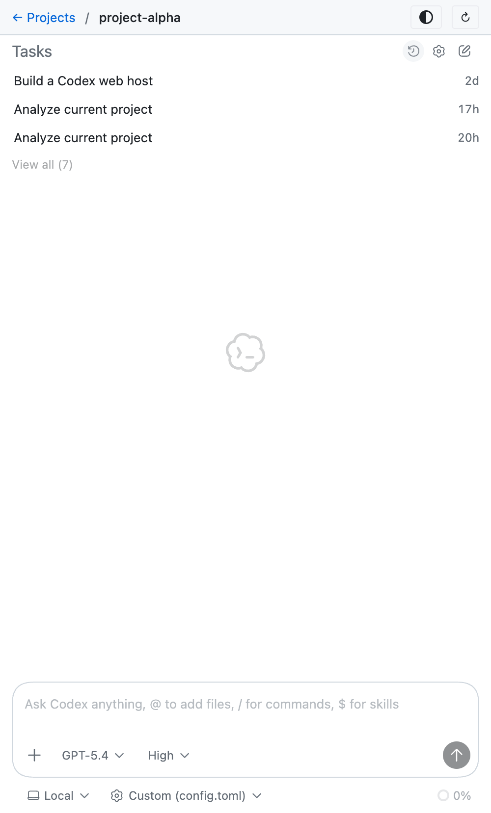
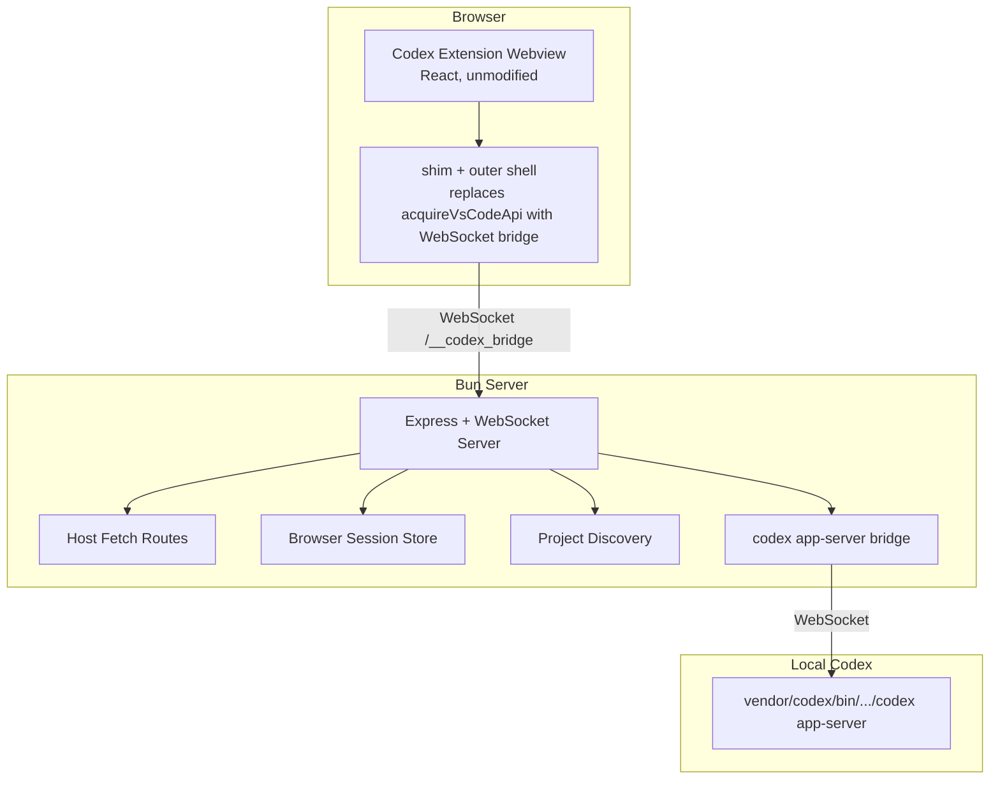
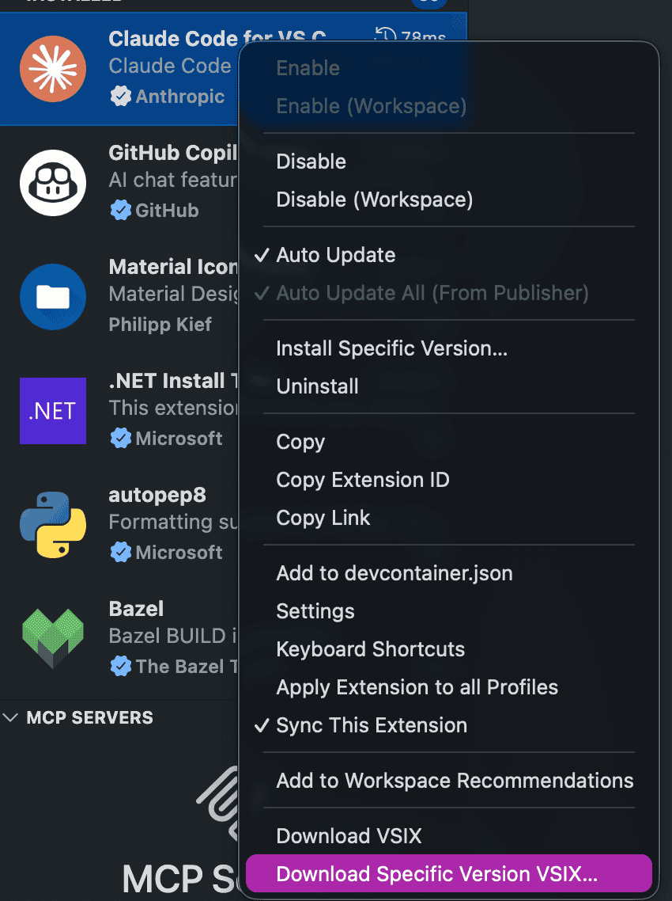

# codex-vs-ext-web — Web-Based Codex

[English](README.md) | [简体中文](README.zh-CN.md)

A standalone Codex web interface that runs in a modern browser. `codex-vs-ext-web` reuses the official VS Code Codex extension frontend through a Bun-based host shim and bridges the page to a local `codex app-server`.

Instead of rebuilding the chat UI, this project serves the original webview from `vendor/codex`, injects a browser shim for `acquireVsCodeApi()`, and implements the host APIs the frontend expects. The goal is to keep the extension experience as intact as possible while keeping `vendor/codex` read-only.

## Screenshots

<table>
  <tr>
    <td></td>
    <td></td>
  </tr>
</table>

## How It Works



**Key Insight**: `codex-vs-ext-web` does not recreate the Codex UI. It serves the original extension webview and injects a shim that replaces VS Code's `acquireVsCodeApi()` with a browser-to-host bridge, so the extension frontend can run in a normal browser.

## Features

- **Original Codex Frontend** — Uses the official Codex extension UI from `vendor/codex/webview`
- **Project Discovery** — Finds recent projects from `~/.codex/sessions`
- **Project Landing Page** — Opens Codex from an outer project list instead of VS Code
- **Session Resume** — Syncs the active conversation into the browser URL and restores it on refresh
- **Theme Switching** — GitHub Dark / GitHub Light themes, persisted in `localStorage`
- **Workspace File Mention** — `@` can search and attach files from the current project
- **Task Isolation by Project** — Recent tasks are scoped to the current project path
- **Auto Reconnect** — The browser bridge and `codex app-server` reconnect automatically after disconnects
- **Minimal Host Emulation** — Implements the `vscode://codex/*` routes, shared objects, and persisted atoms needed by the frontend

## Prerequisites

- **Bun** 1.x
- **Official VS Code Codex extension** extracted into `vendor/codex/`
- **Platform Support**
  - **macOS**
  - **Windows**
  - **Linux**

Binary resolution order:

1. Matching platform binary from `vendor/codex/bin/...`
2. `CODEX_CLI_PATH`
3. System `codex` or `codex.exe` from `PATH`

See `src/config.ts`.

## Quick Start

```bash
# 1. Install dependencies
bun install

# 2. Prepare vendor/codex (see below)
# 3. Start the dev server
bun run dev

# 4. Open http://127.0.0.1:4187
```

Production-style start:

```bash
bun run start
```

Type checking:

```bash
bun run check
```

## Vendor Setup

Extract the official VS Code Codex extension into `vendor/codex/`. Do not copy build artifacts from the reference project.

**Option 1: From an installed VS Code extension**

**Windows:**

```bash
dir "%USERPROFILE%\\.vscode\\extensions\\openai.chatgpt-*"
xcopy /E /I "%USERPROFILE%\\.vscode\\extensions\\openai.chatgpt-<VERSION>" vendor\\codex\\
```

**macOS / Linux:**

```bash
ls -d ~/.vscode/extensions/openai.chatgpt-*
cp -r ~/.vscode/extensions/openai.chatgpt-<VERSION> vendor/codex/
```

> Replace `<VERSION>` with the extension version directory you want to use.

**Option 2: Download VSIX directly from VS Code**

In the VS Code extensions panel, choose **Download Specific Version VSIX...** for the Codex extension:



Then extract the downloaded `.vsix` file:

```bash
unzip openai-chatgpt.vsix -d temp-extract
mv temp-extract/extension/* vendor/codex/
rm -rf temp-extract
```

**Option 3: From an existing `.vsix` file**

```bash
unzip openai-chatgpt.vsix -d temp-extract
mv temp-extract/extension/* vendor/codex/
rm -rf temp-extract
```

**Updating the vendor directory:**

```bash
rm -rf vendor/codex
cp -r ~/.vscode/extensions/openai.chatgpt-<VERSION> vendor/codex/
grep '"version"' vendor/codex/package.json
```

Required directories:

- `vendor/codex/webview`
- `vendor/codex/bin`
- `vendor/codex/resources`

The exact binary subdirectory depends on your platform, for example:

- `vendor/codex/bin/macos-aarch64/codex`
- `vendor/codex/bin/macos-x86_64/codex`
- `vendor/codex/bin/linux-x86_64/codex`
- `vendor/codex/bin/windows-x86_64/codex.exe`

## Commands

| Command | Description |
|---------|-------------|
| `bun run dev` | Start with Bun watch mode |
| `bun run build` | Run the TypeScript build check |
| `bun run start` | Start the Bun server |
| `bun run check` | Run TypeScript type checking |

## Configuration

Environment variables:

| Variable | Description | Default |
|---------|-------------|---------|
| `PORT` | Web server port | `4187` |
| `CODEX_APP_SERVER_PORT` | Local `codex app-server` port | `4188` |
| `CODEX_CLI_PATH` | Override path to the Codex CLI binary | unset |

Example:

```bash
PORT=4187 CODEX_APP_SERVER_PORT=4188 bun run start
```

Session URL format:

```text
/app?project=<base64-path>&session=<conversation-id>
```

| Field | Description |
|-------|-------------|
| `project` | Current project path encoded in base64 |
| `session` | Active local conversation ID |

<details>
<summary><b>Project Structure</b></summary>

```text
src/
├── index.ts          # HTTP / WebSocket entrypoint and browser bridge
├── html.ts           # projects page and app shell HTML injection
├── shim.ts           # browser acquireVsCodeApi shim
├── app-server.ts     # codex app-server lifecycle and reconnect logic
├── fetch-routes.ts   # vscode://codex/* host fetch handlers
├── projects.ts       # project discovery from ~/.codex/sessions
├── state.ts          # global state, shared objects, persisted atoms
└── config.ts         # ports, paths, vendor binary resolution

vendor/
└── codex/            # official Codex extension files, kept read-only
```

</details>

<details>
<summary><b>Protocol Overview</b></summary>

### Browser Bridge

The browser loads the original Codex webview and receives an injected shim. That shim:

1. Replaces `acquireVsCodeApi()`
2. Stores webview state in `sessionStorage`
3. Forwards messages through `WebSocket /__codex_bridge`
4. Intercepts theme-related `vscode://codex/get-configuration` and `set-configuration`

### Host Responsibilities

The Bun server is responsible for:

1. Serving `vendor/codex/webview` assets
2. Injecting the outer shell, project navigation, and session restore guards
3. Handling `vscode://codex/*` fetch routes
4. Keeping per-project shared state and persisted atoms
5. Bridging browser messages to the local `codex app-server`

### codex app-server

Conversation history, task lists, and message generation are still handled by the official local `codex app-server`. This project wraps that server and reconnects when the websocket or child process drops.

</details>

<details>
<summary><b>Known Limitations</b></summary>

- **Not a full 1:1 extension clone** — Only the host behavior needed by the current frontend is implemented
- **Platform support depends on your binary** — You need a matching vendor binary or a working system `codex` in `PATH`
- **Some host APIs are still minimal** — Remote connections, MCP, and environment management are not fully implemented
- **File picker UX still needs polish** — Upload works, but the interaction is not fully aligned with the extension yet
- **Vendor upgrades may require re-adaptation** — Changes inside `vendor/codex` may require shell updates

</details>

<details>
<summary><b>Troubleshooting</b></summary>

### `Conversation not found` appears briefly during refresh

The outer shell delays revealing the vendor app during restore. If a restore still lands in a bad intermediate state, refresh the same `session` URL once more.

### `app-server websocket closed`

The bridge will auto-reconnect, and the frontend reload action is wired to restart the local `codex app-server`. If needed, reload `http://127.0.0.1:4187`.

### Theme switching does not affect the inner webview

Only `GitHub Light` and `GitHub Dark` are supported. The selected theme is stored in browser `localStorage` and forwarded through the shim. Hard refresh the page if an old theme is stuck.

</details>

## Design Principles

- `vendor/codex` stays read-only
- Prefer protocol shims over UI rewrites
- Keep the extension frontend as intact as possible
- Make browser refresh and resume behave like a real session

## Reference

The README structure and outer-shell direction are aligned with `../claude-vs-ext-web`, but the Codex bridge, runtime behavior, and host implementation are specific to this project.
