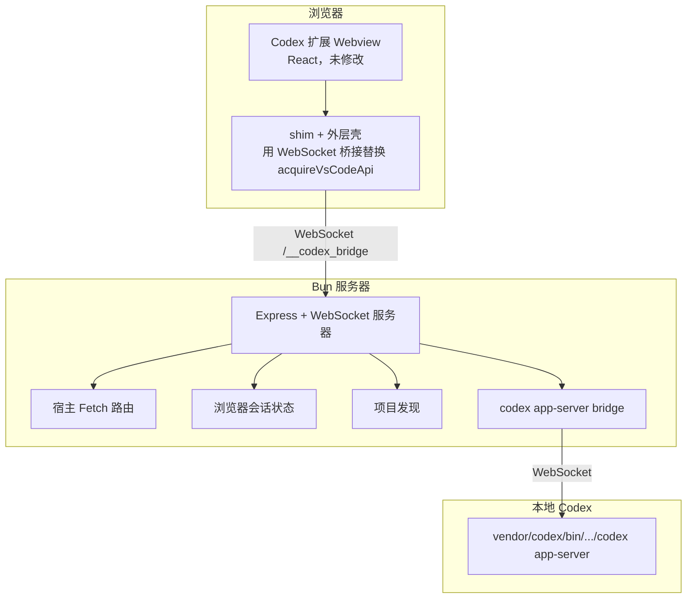

# codex-vs-ext-web — 基于 Web 的 Codex

[English](README.md) | [简体中文](README.zh-CN.md)

一个可在现代浏览器中运行的独立 Codex Web 界面。`codex-vs-ext-web` 通过 Bun 宿主 shim 复用官方 VS Code Codex 扩展前端，并把页面桥接到本地 `codex app-server`。

这个项目不重写聊天 UI，而是直接服务 `vendor/codex` 里的原始 webview，并注入浏览器版 `acquireVsCodeApi()` shim，再补前端依赖的宿主接口。目标是尽量保持原插件味道，同时让 `vendor/codex` 始终只读。

## 截图

<table>
  <tr>
    <td></td>
    <td></td>
  </tr>
</table>

## 工作原理



**核心思路**：`codex-vs-ext-web` 不重建 Codex UI，而是直接提供扩展原始 webview，并注入一个 shim，把 VS Code 的 `acquireVsCodeApi()` 替换成浏览器到宿主的桥接层，让扩展前端在普通浏览器里工作。

## 功能特性

- **原生 Codex 前端** — 直接使用 `vendor/codex/webview` 中的官方界面
- **项目发现** — 从 `~/.codex/sessions` 自动发现最近项目
- **项目入口页** — 先从外层项目列表进入，再打开 Codex
- **会话恢复** — 把当前会话同步进浏览器 URL，刷新后自动恢复
- **主题切换** — GitHub Dark / GitHub Light，两种主题保存在 `localStorage`
- **工作区文件引用** — `@` 可搜索并附加当前项目文件
- **按项目隔离任务列表** — Recent tasks 按当前项目路径过滤
- **自动重连** — 浏览器 bridge 和 `codex app-server` 掉线后都会自动恢复
- **最小宿主模拟** — 实现前端依赖的 `vscode://codex/*`、shared object、persisted atom

## 前置条件

- **Bun** 1.x
- **官方 VS Code Codex 扩展** 解压到 `vendor/codex/`
- **平台支持**
  - **macOS** — 目前只支持 `darwin-arm64`

当前二进制解析路径：

```text
vendor/codex/bin/macos-aarch64/codex
```

见 `src/config.ts`。

## 快速开始

```bash
# 1. 安装依赖
bun install

# 2. 准备 vendor/codex（见下文）
# 3. 启动开发服务器
bun run dev

# 4. 打开 http://127.0.0.1:4187
```

常规启动：

```bash
bun run start
```

类型检查：

```bash
bun run check
```

## Vendor 目录设置

把官方 Codex 扩展解压到 `vendor/codex/`。不要从参考项目复制产物。

**方式 1：从本机已安装的 VS Code 扩展复制**

```bash
ls -d ~/.vscode/extensions/openai.chatgpt-*
cp -r ~/.vscode/extensions/openai.chatgpt-<VERSION>-darwin-arm64 vendor/codex
```

**方式 2：从 VSIX 文件解压**

```bash
unzip openai-chatgpt.vsix -d temp-extract
mv temp-extract/extension/* vendor/codex/
rm -rf temp-extract
```

如果你更习惯从 VS Code 里直接下载 VSIX，可以在扩展面板里选择 **Download Specific Version VSIX...**：


**更新 vendor 目录：**

```bash
rm -rf vendor/codex
cp -r ~/.vscode/extensions/openai.chatgpt-<VERSION>-darwin-arm64 vendor/codex
grep '"version"' vendor/codex/package.json
```

必需目录：

- `vendor/codex/webview`
- `vendor/codex/bin`
- `vendor/codex/resources`

## 命令

| 命令 | 说明 |
|------|------|
| `bun run dev` | 使用 Bun watch 模式启动 |
| `bun run build` | 运行 TypeScript 构建检查 |
| `bun run start` | 启动 Bun 服务 |
| `bun run check` | 运行 TypeScript 类型检查 |

## 配置

环境变量：

| 变量 | 说明 | 默认值 |
|------|------|--------|
| `PORT` | Web 服务端口 | `4187` |
| `CODEX_APP_SERVER_PORT` | 本地 `codex app-server` 端口 | `4188` |

示例：

```bash
PORT=4187 CODEX_APP_SERVER_PORT=4188 bun run start
```

会话 URL 结构：

```text
/app?project=<base64-path>&session=<conversation-id>
```

| 字段 | 说明 |
|------|------|
| `project` | 当前项目路径的 base64 编码 |
| `session` | 当前本地会话 ID |

<details>
<summary><b>项目结构</b></summary>

```text
src/
├── index.ts          # HTTP / WebSocket 入口与浏览器桥接
├── html.ts           # 项目页和 app 壳的 HTML 注入
├── shim.ts           # 浏览器 acquireVsCodeApi shim
├── app-server.ts     # codex app-server 生命周期与重连
├── fetch-routes.ts   # vscode://codex/* 宿主 fetch 处理器
├── projects.ts       # 从 ~/.codex/sessions 发现项目
├── state.ts          # global state、shared object、persisted atom
└── config.ts         # 端口、路径、vendor 二进制解析

vendor/
└── codex/            # 官方 Codex 扩展文件，保持只读
```

</details>

<details>
<summary><b>协议概览</b></summary>

### 浏览器桥接

浏览器加载原始 Codex webview 后，会收到一个注入 shim。这个 shim 负责：

1. 替换 `acquireVsCodeApi()`
2. 把 webview 状态写入 `sessionStorage`
3. 通过 `WebSocket /__codex_bridge` 转发消息
4. 拦截主题相关的 `vscode://codex/get-configuration` / `set-configuration`

### 宿主职责

Bun 服务器负责：

1. 服务 `vendor/codex/webview` 静态资源
2. 注入外层壳、项目导航和会话恢复守卫
3. 处理 `vscode://codex/*` fetch 路由
4. 维护按项目隔离的 shared state 和 persisted atom
5. 把浏览器消息桥接到本地 `codex app-server`

### codex app-server

对话历史、任务列表和消息生成仍然由官方本地 `codex app-server` 提供。本项目负责把它拉起来，并在 websocket 或子进程掉线时自动重连。

</details>

<details>
<summary><b>已知限制</b></summary>

- **不是官方插件的 1:1 完整复刻** — 只实现了当前前端运行所需的宿主行为
- **平台支持较窄** — 目前只接了 `darwin-arm64`
- **部分宿主接口仍是最小实现** — 远程连接、MCP、环境管理还不完整
- **文件选择 UX 还在打磨** — 上传已可用，但交互还没完全对齐扩展
- **vendor 升级后可能要重新适配** — `vendor/codex` 内部变化会影响外层壳

</details>

<details>
<summary><b>故障排除</b></summary>

### 刷新时短暂出现 `Conversation not found`

外层壳会在恢复期间先挡住 vendor 页面，等会话 ready 再放出来。如果仍然落到异常中间态，直接用同一个 `session` URL 再刷新一次。

### 出现 `app-server websocket closed`

bridge 会自动重连，前端的 `Reload` 也已经接到本地 `codex app-server` 重启逻辑上。必要时直接重载 `http://127.0.0.1:4187`。

### 切换主题后内层 webview 不生效

当前只支持 `GitHub Light` 和 `GitHub Dark`。主题值保存在浏览器 `localStorage`，并通过 shim 同步给内层前端；如果还停在旧主题，强刷一次页面。

</details>

## 设计原则

- `vendor/codex` 绝对不动
- 优先补宿主协议，不重写 UI
- 尽量保持扩展前端原汁原味
- 让浏览器刷新和恢复更像真实会话，而不是演示页

## 参考

README 结构和外层壳方向参考了 `../claude-vs-ext-web`，但 Codex 桥接、运行时行为和宿主实现都按本项目单独落地。
